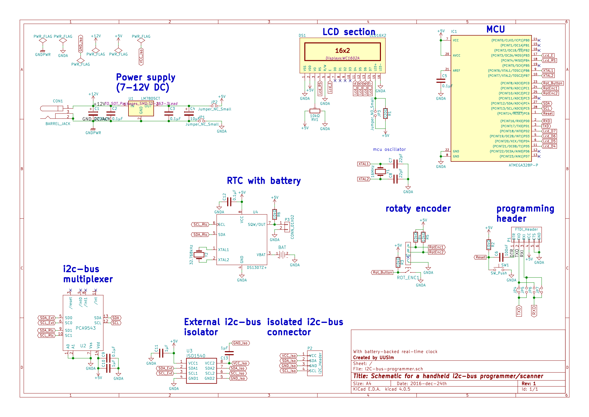

# Handheld i2c bus programmer (with real time clock)
This repository hosts the Kicad-based design for a handheld i2c bus programmer/scanner with real time clock. The device features:
- DC power (rated 7-12V)
- Powered via i2c bus connector (TBD)
- LCD user interface
- Input via rotary encoder with switch
- It's own clock (on separate i2c bus) + battery backup
- Configurable i2c pullup resistors
- Square wave signal of DS1307 accessible via header

Functions:
- Scan for devices on i2c bus
- Debug i2c protocol
- Set/Read time of internal RTC
- Set/Read time RTC on external i2c bus
- Expose own RTC to external i2c bus
- Communicate with i2c devices on bus

